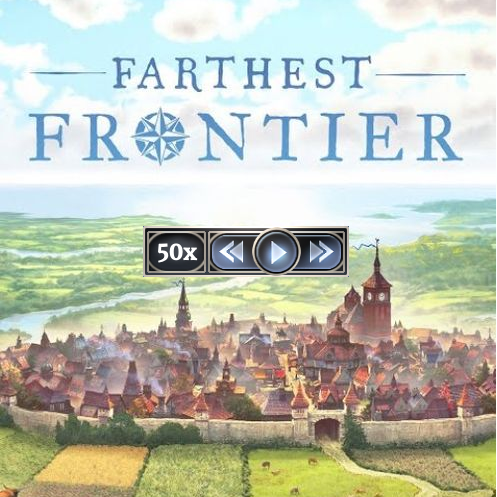

# Farthest Frontier: Game Speed Mod

This mod that enables custom game speeds for the game [Farthest Frontier](https://store.steampowered.com/app/1044720/Farthest_Frontier/).

- Mod version: **0.0.1-alpha**
- Tested with: **v0.7.5f**

## Disclaimer

This is alpha software, as such it might be unstable and cause issues.
This is also my very first mod for this game and the first time I'm using [Melon Loader](https://github.com/LavaGang/MelonLoader).

Finally, I know that modding a game in early access in not that smart but it was fun nonetheless.

## Features

- Unlocks game speeds 5x and 10x which are already in-game but disabled
- Adds more custom game speeds:
  - 15x
  - 20x
  - 30x
  - 50x - *warning: this will drop a lot of frames and probably melt your cpu :)*
- Speed game's color in the UI will change based on the selected speed

## Setup

- Install and configure [Melon Loader](https://github.com/LavaGang/MelonLoader)
  - You can follow **Step 2** on [this guide](https://steamcommunity.com/sharedfiles/filedetails/?id=2854936721)
- Download the dll from [releases page](../../releases) and place it under **_game folder_/Mods**
- Start the game
  - Melon Loader's console will start too. This will contain useful debug messages so keep an eye on it in case of errors.
  
## Usage

Use the increase/decrease speed buttons in the UI or use any of the new hotkeys:
- *5* - 5x speed
- *6* - 10x speed
- *7* - 15x speed
- *8* - 20x speed
- *9* - 30x speed
- *0* - 50x speed

## TODO

- A better readme
- Mod initialization once the game loads and not in the main loop
